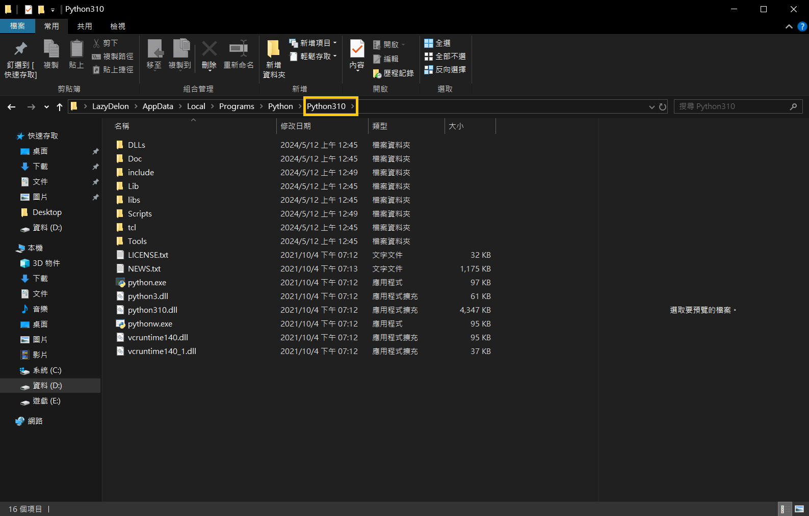

# ERROR MESSAGES

## 🎓 1. &nbsp; The connection between pymysql and sql server is frozen


### Describe the bug

**$\color{orange}{\textsf{When using pymssql version 2.2.8 - 3.3.0 it freeze on connection, with no error, no timeout, just hang there forever.}}$**


### To Reproduce

```Program Code
Database_connection = f"mssql+pymssql://{USERNAME}:{PASSWORD}@{SERVER}:{PORT}/{DATABASE}"
engine = create_engine(Database_connection)
Connection = engine.connect()
```


### Expected behavior

**$\color{orange}{\textsf{connect to sql server.}}$**


### Current Behavior

**$\color{orange}{\textsf{freeze on connection line.}}$**


### Context (Environment)

* **OS : windows 10 64bit**
* **python : 3.8.9 - 3.12.3 (both)**
* **sqlalchemy : 2.0.3**
* **pymssql : 2.2.8 ~ 3.3.0 (both)**


### Additional context

**$\color{red}{\textsf{Try to uninstall pymssql version 2.2.8 or above and use version 2.2.7 and solve the problem.}}$**


## 🎓 2. &nbsp; Solve the problem of reading Chinese garbled characters in SQL Server connection database


### Describe the bug

**SQL Server does not natively support UTF-8. When using VARCHAR to store Traditional Chinese, font garbled characters will appear and need to be converted.**


### Solution

**We need to use the cast function to save the Traditional Chinese data row fields and use NVARCHAR to save the Traditional Chinese, which can solve the problem of Chinese garbled characters.**


### Expected behavior


**When converting a data table from SQL1 to SQL2, all the Chinese characters became garbled when converting to SQL2.**

**Although varchar is used, difficult Chinese characters are not used. According to common sense, it will be displayed normally on SQL1 and no exception should occur on SQL2.**

**After comparing the two SQL databases, the difference lies in the ordering.**

**This is why garbled characters appear when reading Chinese on SQL SERVER.**


### Current Behavior


**Basically there is no problem with nvarchar function. It can be seen that in different sequences, the varchar function will become a question mark in Chinese display.**

**Therefore, if you develop a Chinese system, you must pay attention to the sorting of the database.**

**Otherwise, always use the nvarchar function.**


### Context (Environment)

* **OS : windows 10 64bit**
* **python : 3.8.9 - 3.12.3 (both)**
* **SQL : SQL SERVER**
* **type : varchar**


### 字串(元)資料 (Character & Strings Data)：


| **資料類型**  |	**描述** |	
| ---- | ---- |
| **char(n)**	| **固定長度的字串。最多 255 個字元** |
| **varchar(n)**	| **可變長度的字串。最多 65,535 個字元** |
| **Text**	| **可變長度的字串。最多 2^16 - 1 字元資料** |


#### Unicode 字串：

| **資料類型**  |	**描述** |	
| ---- | ---- |
| **nchar(n)**	| **固定長度的 Unicode 資料。同char(n) CHARSET utf8** |
| **nvarchar(n)**	| **可變長度的 Unicode 數據。同varchar(n) CHARSET utf8** |
| **ntext**	| **可變長度的 Unicode 數據。同text CHARSET utf8** |


## 🎓 3. &nbsp; cx_Oracle error. DPI-1047: Cannot locate a 64-bit Oracle Client library

### Describe the bug

**Python uses cx_Oracle to connect to the Oracle Database**


### Expected behavior

**DatabaseError: DPI-1047: Cannot locate a 64-bit Oracle Client library: "The specified module could not be found". See https://oracle.github.io/odpi/doc/installation.html#windows for help**


### Solution


**$\color{orange}{\textsf{cx-Oracle}}$**

``` 
pip install cx-Oracle
```


**$\color{orange}{\textsf{oracledb}}$**

```
pip install oracledb
```


* **1. Download 64-bit version of oracle instantClient from: https://www.oracle.com/database/technologies/instant-client/winx64-64-downloads.html**

&nbsp; 


* **2. Copy the dll files in the instantclient directory to the python directory, as shown below**

&nbsp; 


➤  **資料來源：** [**cx_Oracle error. DPI-1047: Cannot locate a 64-bit Oracle Client library**](https://stackoverflow.com/questions/56119490/cx-oracle-error-dpi-1047-cannot-locate-a-64-bit-oracle-client-library/)
