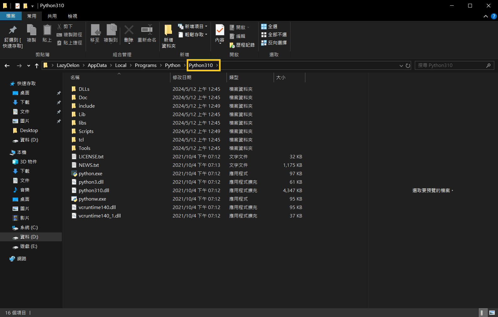

## 🎓 &nbsp; cx_Oracle error. DPI-1047: Cannot locate a 64-bit Oracle Client library

### Describe the bug

**Python uses cx_Oracle to connect to the Oracle Database**


### Expected behavior

**DatabaseError: DPI-1047: Cannot locate a 64-bit Oracle Client library: "The specified module could not be found". See https://oracle.github.io/odpi/doc/installation.html#windows for help**


### Solution


**$\color{orange}{\textsf{cx-Oracle}}$**

``` 
pip install cx-Oracle
```


**$\color{orange}{\textsf{oracledb}}$**

```
pip install oracledb
```


* **1. Download 64-bit version of oracle instantClient from: https://www.oracle.com/database/technologies/instant-client/winx64-64-downloads.html**

&nbsp; 


* **2. Copy the dll files in the instantclient directory to the python directory, as shown below**

&nbsp; 
